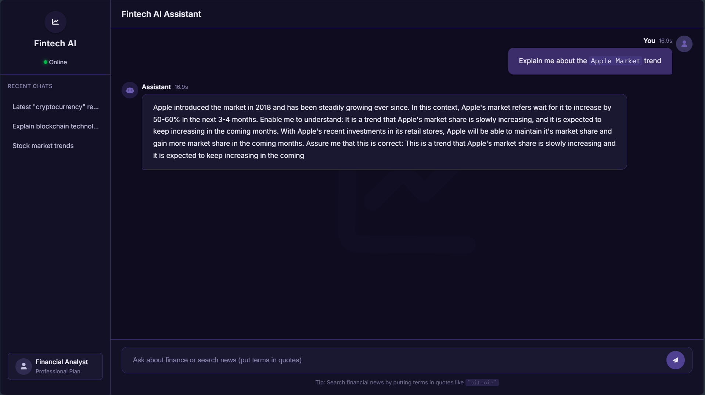

# Fintech AI Assistant



## Overview

The Fintech AI Assistant is a sophisticated RAG (Retrieval-Augmented Generation) chatbot designed to provide expert-level responses about fintech topics and financial news. It combines document retrieval from a curated fintech guide with real-time financial news integration to deliver comprehensive, up-to-date answers.

## Features

- **Fintech Knowledge Base**: Answers questions using a comprehensive fintech guide PDF
- **Real-time News Integration**: Searches for financial news when users include quoted terms (e.g., "bitcoin")
- **Advanced RAG Pipeline**: Combines document retrieval with LLM generation for accurate responses
- **Responsive Web Interface**: Modern UI with mobile support
- **Error Handling & Retries**: Robust error recovery mechanisms
- **Performance Monitoring**: Response timing and system health checks

## Technology Stack

### Backend
- **Python 3.10+**
- **FastAPI**: Web framework for building APIs
- **LangChain**: Framework for building RAG applications
- **HuggingFace**: For embeddings and LLM inference
- **FAISS**: Vector database for efficient similarity search
- **NewsAPI**: For fetching financial news

### Frontend
- **HTML5/CSS3**: Modern responsive design
- **Jinja2 Templates**: Server-side rendering

## Installation

### Prerequisites
- Python 3.10 or later
- pip package manager
- Git (optional)

### Setup

1. **Clone the repository**:
   ```bash
   git clone https://github.com/iamram33z/langchain-chat-bot.git
   ```

2. **Create a virtual environment**:
   ```bash
   python -m venv .venv
   source .venv/bin/activate  # On Windows use `.venv\Scripts\activate`
   ```

3. **Install dependencies**:
   ```bash
   pip install -r requirements.txt
   ```

4. **Set up environment variables**:
   - Create a `.env` file in the root directory
   - Add your API keys:
     ```
     HUGGINGFACE_API_KEY=your_huggingface_api_key
     NEWS_API_KEY=your_newsapi_key
     ```

5. **Add your fintech document**:
   - Place your PDF document in `chatbot/data/fintech_guide.pdf`

## Running the Application

### Development Mode
```bash
uvicorn chatbot.app.main:app --reload
```

### Production Mode
```bash
./run.sh
```

The application will be available at `http://localhost:8000`

## Project Structure

```
langchain-chat-bot/
├── chatbot/
│   ├── app/
│   │   ├── main.py              # FastAPI application
│   │   ├── rag_pipeline.py      # RAG pipeline implementation
│   │   ├── static/              # Static files (CSS, images)
│   │   │   ├── favicon.ico
│   │   │   └── style.css
│   │   ├── templates/           # HTML templates
│   │   │   └── index.html
│   ├── data/                    # Document storage
│   │       └── fintech_guide.pdf
│   └── notebooks/               # Jupyter notebooks for experimentation
├── .env                         # Environment variables
├── .gitignore
├── LICENSE
├── README.md
├── requirements.txt             # Python dependencies
└── run.sh                       # Startup script
```

## API Endpoints

- `GET /`: Main chat interface
- `POST /ask`: Process user questions
- `GET /api/chat`: Programmatic API endpoint
- `GET /health`: System health check

## Configuration

The system can be configured through environment variables:

| Variable | Description | Default |
|----------|-------------|---------|
| `HUGGINGFACE_API_KEY` | HuggingFace API key | Required |
| `NEWS_API_KEY` | NewsAPI key | Optional |
| `LLM_MODEL` | HuggingFace LLM model | `meta-llama/Llama-3.2-1B` |
| `EMBEDDING_MODEL` | Sentence embedding model | `sentence-transformers/all-MiniLM-L6-v2` |
| `MAX_RETRIES` | Maximum LLM retry attempts | `3` |
| `TIMEOUT` | API timeout in seconds | `30` |
| `RETRIEVAL_K` | Number of document chunks to retrieve | `3` |
| `CHUNK_SIZE` | Document chunk size | `400` |
| `CHUNK_OVERLAP` | Chunk overlap size | `50` |

## Usage

1. **Basic Queries**:
   - Ask any fintech-related question (e.g., "Explain blockchain technology")
   
2. **News Search**:
   - Include quoted terms to search for financial news (e.g., "bitcoin" prices today)

3. **API Access**:
   ```bash
   curl "http://localhost:8000/api/chat?question=What%20is%20DeFi"
   ```

## Troubleshooting

### Common Issues

1. **Missing API Keys**:
   - Ensure both `.env` file exists and contains valid API keys
   - The application will run without `NEWS_API_KEY` but without news functionality

2. **Document Not Found**:
   - Verify `fintech_guide.pdf` exists in `chatbot/data/`

3. **Slow Responses**:
   - Reduce `CHUNK_SIZE` and `RETRIEVAL_K` values in `rag_pipeline.py`
   - Consider using a GPU for faster embeddings

## Contributing

1. Fork the repository
2. Create a feature branch (`git checkout -b feature/your-feature`)
3. Commit your changes (`git commit -am 'Add some feature'`)
4. Push to the branch (`git push origin feature/your-feature`)
5. Create a new Pull Request

## License

This project is licensed under the MIT License - see the [LICENSE](LICENSE) file for details.

## Acknowledgements

- LangChain for the RAG framework
- HuggingFace for models and inference
- NewsAPI for financial news
- FastAPI for the web framework
